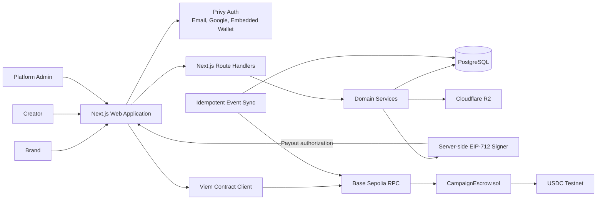
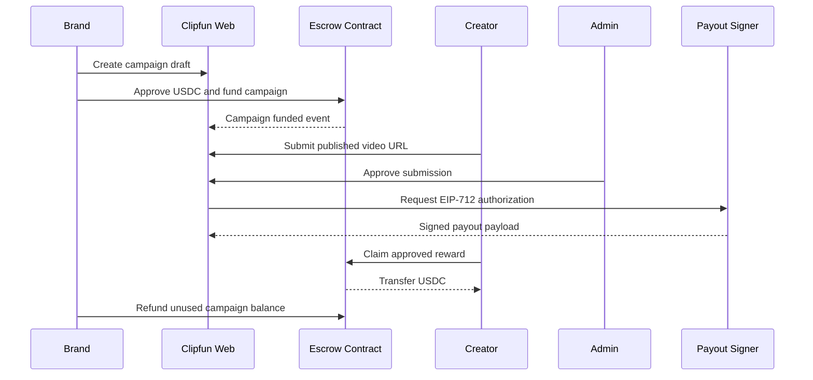

# Clipfun

> Fund the brief. Create the clip. Claim the reward.

Clipfun is an onchain campaign marketplace that connects brands with short-form
video creators. Brands publish funded creative campaigns, creators submit
content, platform administrators review submissions, and approved rewards are
claimed transparently in USDC.

This repository is an active hackathon build. The current release focuses on
the complete product interface and authentication foundation. Campaign,
submission, transaction, and payout data are still simulated locally while the
escrow contract and production backend are being developed.

## Product vision

Traditional creator campaigns spread briefs, reviews, and payments across
multiple tools. Clipfun brings the entire workflow into one product:

```text
FUND → PUBLISH → SUBMIT → REVIEW → CLAIM → REFUND
```

- Brands know exactly how much budget is committed.
- Creators can verify that a reward pool exists before producing content.
- Administrators have a dedicated moderation workflow.
- Financial activity is designed to be independently verifiable on Base.

## Current development status

| Area | Status |
| --- | --- |
| Responsive marketplace UI | Implemented |
| Brand campaign builder | Implemented with mock state |
| Creator submissions and rewards | Implemented with mock state |
| Admin moderation console | Implemented with role-gated UI |
| Privy authentication | SDK integrated; App ID required |
| Embedded and external wallets | Privy configuration prepared |
| Local persistence | Implemented with `localStorage` |
| PostgreSQL and application API | Planned |
| Campaign escrow contract | Planned |
| Base Sepolia transactions | Planned |

No real funds are used by the current application.

## Demo flows

### Brand

1. Sign in through Privy.
2. Create a campaign draft.
3. Configure the fixed USDC reward and maximum paid submissions.
4. Simulate wallet confirmation and campaign funding.
5. Monitor submissions and refund the unused reward pool.

### Creator

1. Sign in and register a social profile.
2. Explore funded campaign opportunities.
3. Submit a public TikTok, YouTube Shorts, or Instagram Reels URL.
4. Track the moderation status.
5. Simulate claiming an approved USDC reward.

### Administrator

Administrators use the same Privy login as every other user. Admin authorization
does not come from a public role selector: it is determined from a Privy user
DID allowlist during this development phase. PostgreSQL-backed server
authorization will replace the allowlist.

## Technology stack

| Layer | Technology | Responsibility |
| --- | --- | --- |
| Web application | Next.js 15 App Router | Pages, layouts, server endpoints, and deployment unit |
| Interface | React 19 + TypeScript | Typed interactive product flows |
| Styling | Tailwind CSS + Radix primitives | Responsive editorial/brutalist design system |
| Authentication | Privy React SDK | Email, Google, and wallet authentication |
| Wallets | Privy embedded wallet + external EVM wallets | Funding and reward recipient identity |
| EVM client | Viem | Base Sepolia reads, writes, and receipt handling |
| Network | Base Sepolia | Testnet-only settlement environment |
| Payment token | USDC testnet | Campaign funding, rewards, fees, and refunds |
| Application API | Next.js Route Handlers | Domain APIs and server-side authorization |
| Database | PostgreSQL + Drizzle ORM | Users, campaigns, submissions, payouts, and audit history |
| Validation | Zod | Request and domain input validation |
| Smart contracts | Solidity + OpenZeppelin | Shared campaign escrow and payout verification |
| Contract tooling | Foundry | Contract tests, scripts, and Base Sepolia deployment |
| Object storage | Cloudflare R2 | Campaign briefs and reference attachments |
| Testing | Vitest + Playwright + Foundry | Unit, end-to-end, and smart-contract testing |
| Deployment | Vercel + managed PostgreSQL | Web application and persistent application data |
| Observability | Sentry + PostHog | Error monitoring and product analytics |

The current repository already uses Next.js, React, TypeScript, Tailwind,
Privy, and Viem. Database, API, contract, storage, testing, and observability
layers are the next implementation phases.

## System architecture

Clipfun follows a modular-monolith architecture for the MVP. UI, application
API, business rules, moderation, and blockchain synchronization share one
Next.js codebase, while authentication, storage, database, RPC, and contracts
remain external dependencies.



### Application boundaries

```text
Next.js modular monolith
├── Public marketplace
├── Brand campaign workspace
├── Creator submission and reward workspace
├── Internal admin moderation console
├── Authentication and user synchronization
├── Campaign domain
├── Submission and moderation domain
├── Payout authorization domain
└── Blockchain transaction and event synchronization
```

### Data ownership

| Onchain | Offchain |
| --- | --- |
| Campaign owner and escrow balance | Privy user and social profiles |
| Reward pool and fee reserve | Full creative brief and attachments |
| Deadline and maximum winners | Submission URL and moderation notes |
| Claimed submission and nonce protection | Payout authorization record |
| Paid winner count | Transaction synchronization state |
| Refund state and event logs | Audit and notification history |

The backend never holds the campaign reward pool. It only stores application
data and signs an EIP-712 payout authorization after an administrator approves
a submission.

## Core transaction flow



The UI communicates through domain-oriented service interfaces. The current
mock services can therefore be replaced incrementally by PostgreSQL, API, and
blockchain adapters without rewriting page components.

## Project structure

```text
app/
├── admin/                 Admin moderation console
├── brand/                 Brand dashboard and campaign builder
├── campaigns/[id]/        Campaign detail and submission flow
├── clipper/               Creator dashboard and reward claims
├── explore/               Public campaign marketplace
├── activity/              Transaction activity
├── providers.tsx          Privy and network configuration
└── page.tsx               Landing page

components/
├── ui/                    Reusable UI primitives
├── auth-gate.tsx          Development route authorization
├── demo-provider.tsx      Mock domain services and persistence
└── site-header.tsx        Public/member/admin navigation

lib/
├── fixtures.ts            Development fixtures
├── types.ts               Domain models and service contracts
└── utils.ts               Shared utilities
```

## Local setup

### Requirements

- Node.js 20 or newer
- npm
- A Privy application for real authentication

### Installation

```bash
git clone https://github.com/PERTAMAX16K/clipfun.git
cd clipfun
npm install
```

Copy the example environment configuration:

```bash
cp .env.example .env.local
```

On Windows PowerShell:

```powershell
Copy-Item .env.example .env.local
```

Configure the public Privy identifiers:

```env
NEXT_PUBLIC_PRIVY_APP_ID=your_privy_app_id
NEXT_PUBLIC_PRIVY_CLIENT_ID=your_privy_client_id
NEXT_PUBLIC_ADMIN_PRIVY_USER_IDS=did:privy:admin_user_id
```

`NEXT_PUBLIC_ADMIN_PRIVY_USER_IDS` is only a temporary development mechanism.
Do not treat a client-side allowlist as production authorization.

Start the development server:

```bash
npm run dev
```

Open [http://localhost:3000](http://localhost:3000).

## Quality checks

```bash
npm run typecheck
npm run lint
npm run build
```

Type checking and linting pass on the current development snapshot. The Privy
SDK significantly increases the first production build workload, so build time
can be longer on resource-constrained machines.

## Environment and security

- Never commit `.env.local`, Privy secrets, verifier private keys, or wallet
  credentials.
- `PRIVY_APP_SECRET` will only be used by server-side code.
- Admin access must ultimately be enforced by the backend and PostgreSQL.
- The payout signer must never be included in a client bundle.
- The current Base Explorer links and transaction hashes are mock data.

## Roadmap

1. Complete Privy dashboard configuration and validate embedded wallets.
2. Add PostgreSQL, Drizzle ORM, and server-verified user synchronization.
3. Implement and test `CampaignEscrow.sol` with Foundry.
4. Deploy the escrow contract and mock USDC workflow to Base Sepolia.
5. Replace campaign funding, payout claims, and refunds with Viem transactions.
6. Add idempotent contract event synchronization and end-to-end tests.
7. Deploy the web application and managed PostgreSQL environment.

## Network target

```text
Network: Base Sepolia
Chain ID: 84532
USDC: 0x036CbD53842c5426634e7929541eC2318f3dCF7e
Explorer: https://sepolia.basescan.org
```

Clipfun is currently testnet-only. It must not be used for production financial
transactions.
